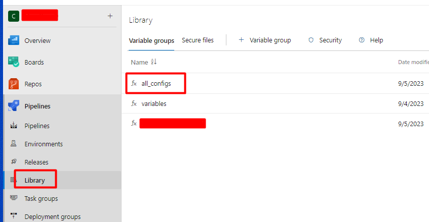
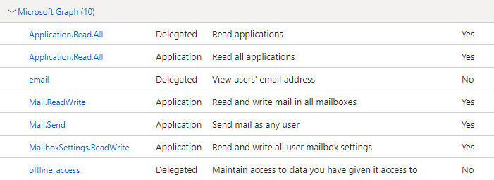

# Azure App Registration Key Expiration Checker

This Python script automates the process of checking the expiration time of keys in application registrations in different tenants on Azure. If the expiration time is less than 10 days, it sends an email notification. We also give an excel to the application. Excel contains the tenant id and app id of the applications. The script automatically reads and checks this.

## User Guide

1. **Prerequisites**
   - Python should be installed to run this script.
   - Ensure that your Azure API access permissions are correctly configured.
   - I store confidential information in the library in azure devops.

   
   

2. **Create Application Registrations in Azure**
   - This script requires access to application registrations in Azure to check their keys.

3. **Script Configuration**
   - Before running the script, configure the necessary settings within the code (e.g., email sending settings).
    - Create app and give this permissions;

    

   - In the application, there are 3 pieces of information regarding the app registration used by Azure.
   - Application ID
   - Tenant ID
   - Client Secret
   

4. **Run the Script**
   - To run the script, use a terminal or command prompt: `python main.py`

5. **Schedule Execution (Optional)**
   - You can automate this task to run daily or at a specific time using Azure DevOps or another scheduling service.

## Script Contents

- `main.py`: The main Python code that checks application registration keys and sends emails.

## License

This project is licensed under the MIT License. For more information, see the [LICENSE](LICENSE) file.

## Contact

If you have questions or feedback, please email us at [melih.s.urkmez@gmail.com](mailto:melih.s.urkmez@gmail.com) or open a GitHub issue.

